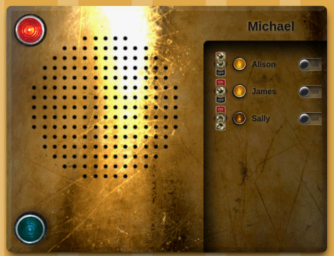

# WebRTC Intercom



An in-house, push-to-talk speaker system, just like mom used to make!

Talk to your house-mates / co-workers over your own private intercom system
without ever hitting the Internet. No accounts, logins, etc. required.

This is a practical hobby project. Sure, it's a useful tool around the house,
but it's also a great learning project for anyone interested in
JavaScript-based, peer-to-peer media streaming.

No magic here. No external libraries used. Just a good number of useful,
intermediate-level web tricks that belong in every developer's tool chest.


## Features

- Direct peer-to-peer voice communication in your browser
- Simultaneous talk/listen - might want headphones for this!
- Status lights for connections, requests, and voice transmission
- Runs from a file on your desktop or loaded from the server
- Written in pure JavaScript, no external libraries required


## Security

Nope. Nada. None. This is not a secure communication tool.

WebRTC Intercom is designed for use on your own personal network.

That being said, you're pretty safe from eavesdropping over the network.
Audio data is encrypted as part of the WebRTC protocol, and it's transfered
directly between network peers without ever hitting the server.


## Usage

**Start The Server**

On any machine on your network that has NodeJS installed:

```sh
cd /path/to/webrtc-intercom
node server.js
```

**Load The Client** (in a browser)

From your desktop: Open `intercom.html` in your browser of choice.

-OR-

From the server (HTTPS must be enabled): Navigate your browser to
https://YourServerName:8081/intercom

Accept your browser's request to access the microphone.

If you have multiple microphones, you'll need to select the appropriate
one from the provided dropdown.

**Connect To Server**

Type your name in the box in the top right corner and hit enter.

Change your name at any time. Each user must have a unique name.

Disconnect or reconnect using the big red button in the top right corner.
If you lose connection to the server, the red light will flash every few
seconds while it tries to reconnect.

**Connect To Users**

Once online, click a user's name to request a data connection. The yellow
connection light will begin to flash on both your computer and theirs.

The receiving user can then click your name to accept the connection request.

Alternately, either party can click the flashing yellow light to cancel the
request.

**Talk To Users**

Once connected to a user, press-and-hold the black "talk" button next to their
name to talk to them. While you're talking, the large blue light in the bottom
right corner will light up to let you know your sending audio.

When a connected user is talking to you, the black "talk" button next to their
name will light up in green to designate the speaker.

Multiple speakers may talk simultaneously. If you plan on talking at the same
time, you may want to use headphones to avoid feedback from your microphone.

**Disconnect**

You can disconnect (silence!) a user at any time by clicking the switch to the
left of their name to the "off" position.

You can disconnect from everyone (and from the server) by clicking the big red
light in the top left corner.


## Requirements

**Network**

WebRTC Intercom is designed to work on the local network in your home. This
means your computers can talk to each other, but you can't talk to someone
remotely over the internet.

**Browser**

Each user will need a web browser. Updated Firefox and Chrome supported.

Currently mobile devices aren't supported.

**NodeJS**

A signaling server is required to run on one computer on your network. This is
a lightweight server that simply acts as a directory hub for online users. No
audio data ever passes through the server.

Use a recent version of Node. No additional libraries are required.

**OpenSSL** (optional)

If you want HTTPS support, your server will require `server.key` and
`server.cert` files. These can be generated using OpenSSL.

SSL (https) isn't required for the server's directory features, and by
default it always runs in standard http mode. However, if you also want
to serve the user interface from the server, HTTPS is required in modern
browsers to enable the WebRTC protocol.

If you don't wish to enable SSL on your server, each user can store and
run the HTML file locally on their desktop by setting the signaling server
information at the top of the `intercom.html` file.


## Technical

It can be hard to find good WebRTC tutorials out there.

This project was built with learning in mind. To that end, no external
JavaScript libraries, aside from NodeJS built-ins, are used. It's all there
to see how everything works.

No jQuery here!

The client and server are written using standard ES2015-style JavaScript,
taking advantage of modern browser features like the `navigator` built-in for
finding connected media devices and WebRTC for peer-to-peer data transfer.

A few hacks!

To allow everything to run from either the desktop or the server it's
necessary to overcome some CORS (cross-origin resource sharing) hurdles.
A hidden communication IFrame is used to translate and forward data objects.

Additionally, to keep things simple (and avoid external dependencies) we're
using some old-school long polling instead of websockets to talk to the
signaling and directory server.

**Client**

The client file, `intercom.html`, has the following variable block at the top:

```js
const DEFAULT_USERNAME = ''

// Messaging server info
const PROTO  = 'http'
const SERVER = 'localhost'
const PORT   = 8080
const PATH   = '/jsonLoader'
```

If you're running the client directly from your local machine, you can assign
a value to `DEFAULT_USERNAME` to automatically connect every time you open the
file in your browser.

Set `SERVER` to match the network name (or IP address) or the machine hosting
the signaling server.

If you want to run everything over SSL, set `PROTO='https'` and `PORT=8081`
(or whatever port youyou've assigned for HTTPS on your server).

Do not change `PATH`, as this represents the location the hidden IFrame will
use to talk to the server.

NOTE!

When connecting to the server via the HTTPS protocol, you will almost
certainly encounter warnings about "untrusted", "unsafe", "dangerous" or
other terrible sounding words regarding the connection you want to make.

That's because, unless you have registered your internal machines with a
global certificate authority (highly unlikely), you're going to be
self-signing the connection for your network only.

Your browser's just warning you that there's no way to verify the server
with the outside world, and you should only make the connection if you
implicitly trust the destination.

**Server**

The server, `server.js`, can be run from the command line on any machine with
NodeJS installed by simply calling:

```sh
node server.js
```

You can run the server with or without SSL (or both) by adjusting the
`USE_HTTP` and `USE_HTTPS` variables at the top of the file.

To use SSL run the following command on a machine that has OpenSSL:

```sh
openssl req -nodes -new -x509 -keyout server.key -out server.cert
```

Place the generated files, `server.key` and `server.cert`, in the same
directory as the `server.js` file and re-start the server script.

For reference, the server uses the following built-in Node modules:

- **http** - Manages HTTP connections
- **https** - Manages HTTPS connections
- **url** - Parses URLs to route paths to functions
- **querystring** - Parses GET and POST requests and encodes response data
- **fs** - Loads requested html, script, and image files from disk


## FAQ

**Q: I hate the background!**

That's not a question.

**Q: Can I cange the background or re-skin the app?**

Sure. The project's MIT licensed. Edit to your heart's content.

Just retain the copyright notice.

**Q: Others can't hear my audio (?)**

Make sure you have a microphone or webcam plugged in, it's not muted, and you
accepted the browser popup asking to use your microphone when the app loads.

If the problem persists, you might want to test your microphone in an external
application.

**Q: Can I broadcast a message to everyone at the same time?**

Not at the moment.

I'll probably add a broadcast feature to the blue talk light.

**Q: Can I type a message?**

Nope, audio only.

If this becomes a common request I'll find a way to hack in a chat box.

**Q: Since it's peer-to-peer, do I have to run the server?**

Yep. The signaling server (`server.js`) is required for users to find each
other.

Once they're connected to each other, though, that connection will remain
even if the server goes down, as all data transmission is strictly
peer-to-peer.

**Q: How can I change the client's target server address?**

If you're running the client from a file on your desktop, edit `intercom.html`
with your local network server's information.

If you're loading the UI remotely, this information is automatically updated
when the file is served.

**Q: Can I expand this to talk to friends outside my local network?**

Not practically.

This project entirely avoids a dependence on external ICE/STUN/TURN servers.

If you're dead-set on it, though, you could accomplish it with an SSH tunnel.


## License

MIT License. See the `LICENSE` file for more information.